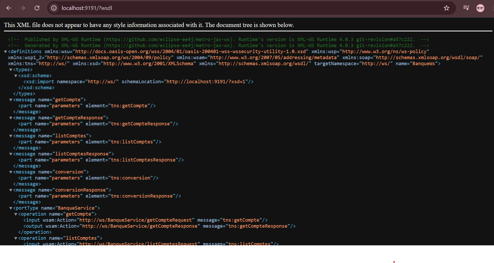
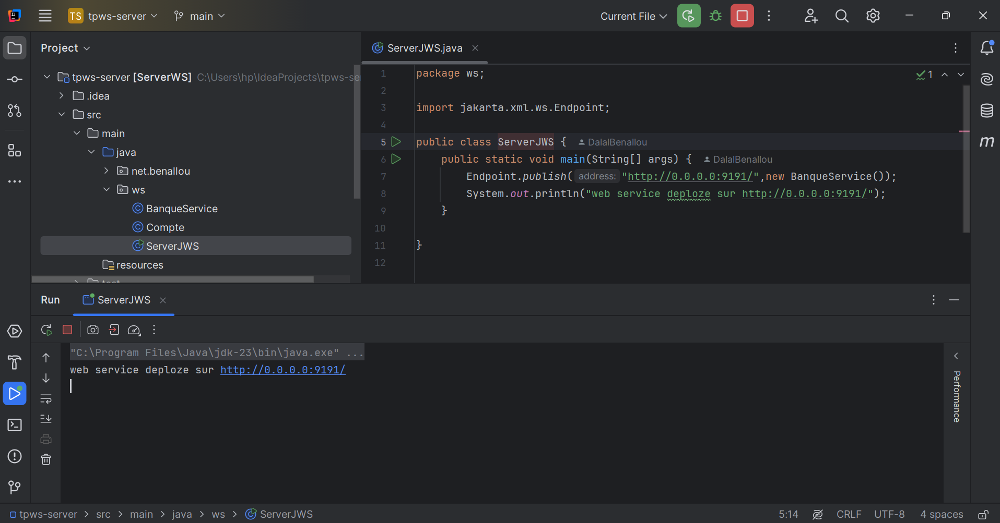
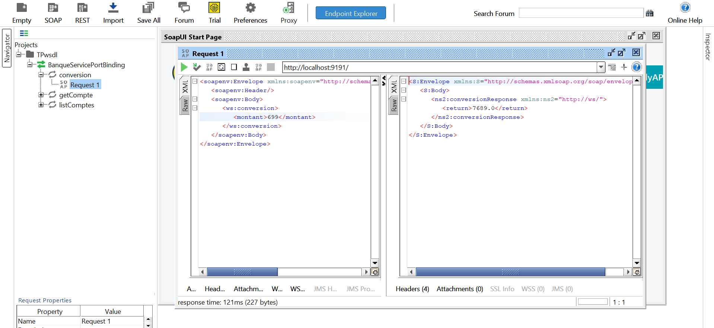
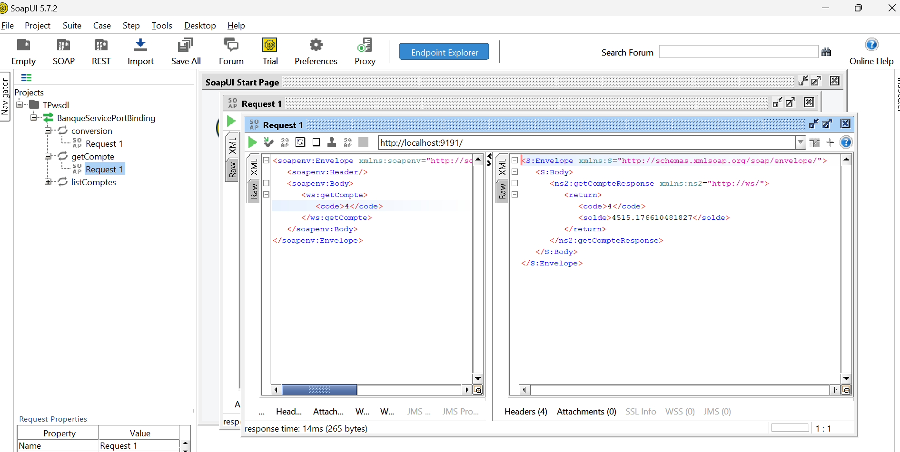
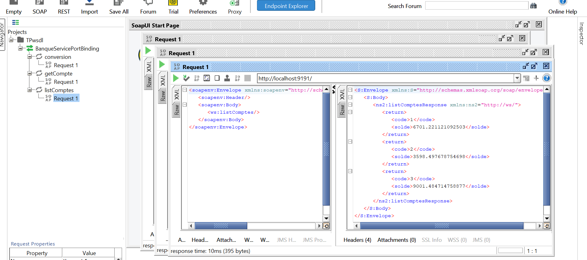
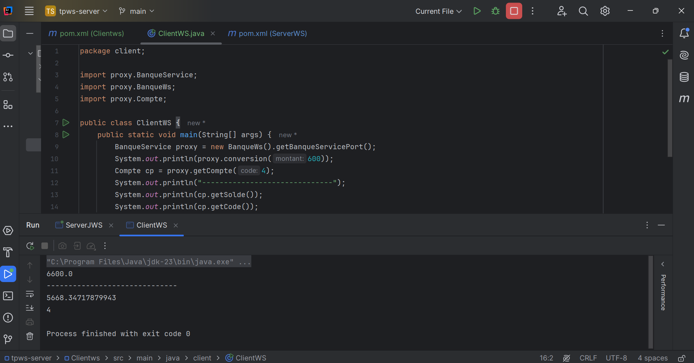

# Rapport de projet Web Service SOAP

## Introduction

Ce projet consiste à développer et déployer un web service SOAP utilisant JAX-WS. Le web service offre trois fonctionnalités principales :

- Conversion de montants en euros vers dirhams marocains (DH).
- Consultation des détails d'un compte bancaire spécifique.
- Consultation de la liste des comptes bancaires disponibles.

## Objectifs

1. Créer un service web fonctionnel basé sur JAX-WS.
2. Déployer le service sur un serveur simple.
3. Générer et analyser le fichier WSDL associé.
4. Tester les opérations du service avec des outils comme SoapUI.

## Images et descriptions

### Première image
Affichage du fichier WSDL d'un service web SOAP nommé **BanqueService** sur l'URL [http://localhost:9191/wsdl](http://localhost:9191/wsdl), décrivant ses méthodes et paramètres.

---

### Deuxième image
Code Java dans IntelliJ IDEA déployant le service web à l'adresse [http://0.0.0.0:9191/](http://0.0.0.0:9191/) avec un message confirmant le déploiement.

---

### Troisième image
Test du web service depuis SoapUI (méthode de conversion).

---

### Quatrième image
Test du web service depuis SoapUI (méthode de `getCompte`).

---

### Cinquième image
Test du web service depuis SoapUI (méthode de `listCompte`).

---

### Sixième image
Test du code service client.

